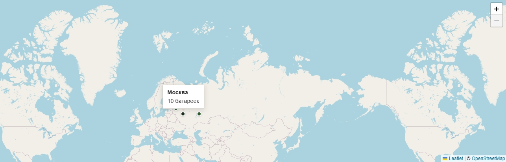

# Батарейки на переработку

Веб-приложение для учёта сданных на переработку батареек. Пользователи регистрируются, добавляют сдачи с указанием города, на главной странице отображается общая статистика.

---

## Цель проекта

Собрать в одном месте данные о том, сколько батареек сдано на переработку, и в каком городе. Это помогает видеть общий вклад в экологию и мотивировать других сдавать батарейки. Тема проекта — **сбор батареек во благо природы**.

**Возможности:**
- Регистрация и авторизация пользователей
- Добавление сдачи: количество батареек и город (автоподстановка российских городов)
- Личная история сдач
- Общий счётчик сданных батареек на главной странице
- **Интерактивная карта России** — точки по городам, где сдавали батарейки, с подсказкой при наведении
- Админ-панель для управления данными

---

## Стек и технологии

| Категория | Технологии |
|-----------|------------|
| Backend | Python 3.12, Django 4.2 |
| База данных | SQLite3 (локально), PostgreSQL (Render) |
| Frontend | HTML5, CSS3, Bootstrap 5, JavaScript |
| Шрифты | Playfair Display, Source Sans 3 (Google Fonts) |
| Продакшен | Gunicorn |
| Контейнеризация | Docker, Docker Compose |
| Карта | Leaflet 1.9, OpenStreetMap |

---

## Карта на главной странице

Внизу главной страницы отображается **интерактивная карта России**.

### Как выглядит карта

- **Подложка:** карта OpenStreetMap — видны границы России, названия регионов и городов, реки, дороги. Стиль нейтральный, карта читаемая.
- **Охват:** по умолчанию карта центрирована на России (центр ~61° с.ш., 99° в.д.) с зумом 3, так что в кадре целиком видна территория страны. Масштаб можно менять колёсиком мыши или кнопками «+»/«−» в правом верхнем углу.
- **Маркеры:** в городах, по которым есть хотя бы одна сдача батареек, отображаются **точки** — зелёные кружки в стиле сайта (цвет «природной» палитры), с белой обводкой и лёгкой тенью. Размер точки небольшой (около 14 px), чтобы не перекрывать карту.

### Что на ней отображается

- **Точки** стоят строго в тех городах, которые пользователи указывали при добавлении сдачи (используется список российских городов с заданными координатами).
- **Одна точка = один город** с хотя бы одной записью о сдаче. Если в Москве сдали 10 раз, а в Казани — 2, на карте будут две точки: в Москве и в Казани.
- **При наведении курсора на точку** появляется **всплывающая подсказка** (тултип): название города и **общее количество сданных батареек в этом городе**. Пример: *«Москва — 25 батареек»*.
- Если сдач по городам ещё не было, карта показывается пустой (без точек), с текстом: *«Пока нет сдач по городам. Добавьте свою первую сдачу в разделе «Мои сдачи»!»*.

Карта помогает наглядно увидеть, в каких городах уже сдают батарейки и сколько там сдано в сумме.



---

## Установка и запуск

### Вариант 1: Локально (без Docker)

1. **Клонируйте репозиторий:**
   ```bash
   git clone https://github.com/ВАШ_ЛОГИН/bat.git
   cd bat
   ```

2. **Создайте виртуальное окружение и установите зависимости:**
   ```bash
   python -m venv venv
   # Windows (PowerShell):
   .\venv\Scripts\Activate.ps1
   # Windows (cmd):
   venv\Scripts\activate.bat
   # Linux/macOS:
   source venv/bin/activate

   pip install -r requirements.txt
   ```

3. **Примените миграции и запустите сервер:**
   ```bash
   python manage.py migrate
   python manage.py runserver
   ```

4. Откройте в браузере: **http://127.0.0.1:8000/**

**Создание суперпользователя (для админки):**
```bash
python manage.py createsuperuser
```
Админка: **http://127.0.0.1:8000/admin/**

---

### Вариант 2: Docker

1. **Клонируйте репозиторий** (если ещё не сделали) и перейдите в папку проекта.

2. **Соберите и запустите контейнер:**
   ```bash
   docker compose up -d --build
   ```

3. Приложение будет доступно по адресу: **http://127.0.0.1:8000/**  
   База данных сохраняется в Docker-томе `db_data`.

4. **Остановка:**
   ```bash
   docker compose down
   ```

**Создание суперпользователя в Docker:**
```bash
docker compose exec web python manage.py createsuperuser
```

---

### Вариант 3: Render (облачный деплой)

1. **Загрузите проект на GitHub** (если ещё не сделали).

2. **Подключите репозиторий к Render:**
   - Перейдите на [dashboard.render.com](https://dashboard.render.com/)
   - Blueprints → New Blueprint Instance
   - Выберите репозиторий с проектом
   - Render создаст Web Service и PostgreSQL по `render.yaml`

3. После деплоя сайт будет доступен по адресу `https://bat-xxxx.onrender.com`

4. **Создание суперпользователя** — в Dashboard Render: ваш сервис → Shell → выполните:
   ```bash
   python manage.py createsuperuser
   ```

**Примечание:** на бесплатном плане сервис «засыпает» после 15 минут неактивности; первый запрос после паузы может занять 30–60 секунд.

---

## Деплой на внешний хостинг (безопасность)

Перед публикацией на внешний сервис **обязательно** настройте переменные окружения (см. `env.example`):

| Переменная | Описание |
|------------|----------|
| `DJANGO_SECRET_KEY` | Уникальный секретный ключ (сгенерируйте новый) |
| `DJANGO_DEBUG` | `0` для продакшена |
| `ALLOWED_HOSTS` | Ваш домен (например, `example.com,www.example.com`) |
| `CSRF_TRUSTED_ORIGINS` | `https://example.com,https://www.example.com` |
| `SECURE_SSL_REDIRECT` | `1` при использовании HTTPS |

Сайт должен работать по **HTTPS**. В проекте включены: защита от XSS, CSRF, clickjacking, HSTS, безопасные cookies.

Проверка настроек: `python manage.py check --deploy`

---

## Пример работы

1. **Главная страница** — общее количество сданных батареек, призыв зарегистрироваться или войти, ниже — **карта России** с точками по городам; при наведении на точку видно название города и количество батареек.
2. **Регистрация** (`/register/`) — ввод имени пользователя, пароля (и опционально email).
3. **Вход** (`/login/`) — авторизация по имени и паролю.
4. **Мои сдачи** (`/my/`) — форма: количество батареек и выбор города. В поле «Город сдачи» при вводе буквы (например, «н») появляется список городов на эту букву (Новосибирск, Нижний Новгород и т.д.); можно выбрать «Город отсутствует». После отправки запись попадает в историю, в общий счётчик на главной и **на карту** (появится или обновится точка в выбранном городе).

---

## Ссылки для скачивания и репозиторий

- **Клонирование репозитория (HTTPS):**
  ```bash
  git clone https://github.com/ВАШ_ЛОГИН/bat.git
  ```

- **Клонирование по SSH** (если настроен ключ):
  ```bash
  git clone git@github.com:ВАШ_ЛОГИН/bat.git
  ```

Замените `ВАШ_ЛОГИН` на ваш логин GitHub после публикации репозитория.

---

## Структура проекта

```
bat/
├── bat/                    # Настройки Django (settings, urls)
├── batteries/              # Приложение: модели, формы, представления, шаблоны
│   ├── city_coordinates.py  # Координаты городов для карты
│   └── cities.py           # Список российских городов
├── templates/              # Базовые шаблоны
├── static/                 # Статические файлы (CSS)
├── manage.py
├── requirements.txt
├── Dockerfile
├── docker-compose.yml
├── render.yaml          # Blueprint для деплоя на Render
├── build.sh             # Скрипт сборки для Render
├── .dockerignore
├── .gitignore
└── README.md
```
